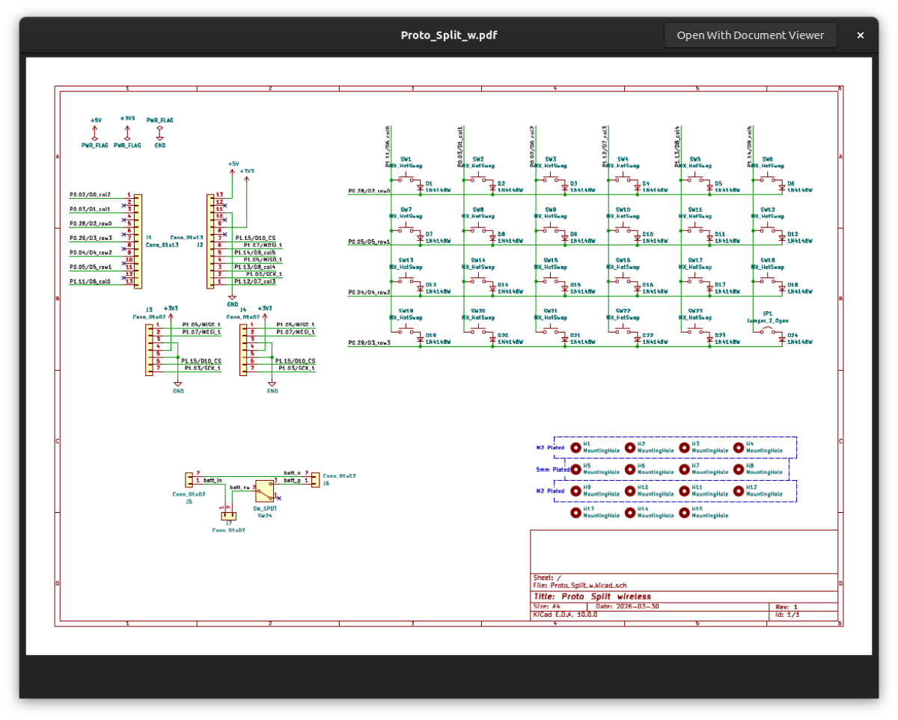

## Proto Split Wireless
 

キーボードマーケットトーキョー2026で初頒布した左右分割キーボード用基板のリポジトリです。 
このbranchではキーケット2026で頒布した、製造番号`10779197A_Y19_260108`についての情報を記載しています。

現在検証中のFWについては後日追記予定ですが、取り急ぎ回路図のPDFファイルを以下に格納しています。

お手元のxiaoモジュールにて検証いただける場合は、以下のPDFファイルを参考にファームウェアを構築いただければと思います。

[PDFファイル](Docs/Proto_Split_w.pdf)
